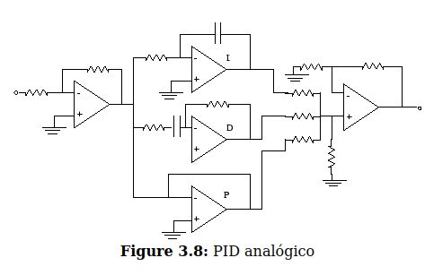

### Objetivo
Este projeto dedica-se a simualr no tinker cad o sistena eletronico de um drone , simulando apens o controle de arfagem , devido as capcidades limitadas do microcontorlador usado, eu será um arduino.
´´´ c
#include <Button.h>
#include  <Encoder.h>

const int PWM0 =  6;
const int PWM1 =  5;
const int BTN_MEM_PIN[] = {7,8};
const int READY =  13;
int currentPos = 0;
int newPosition = 0;
int runningSpeed = 0;
long distanceTogo = 0;

Encoder myEnc(2, 3);
long oldPosition  = -999;
long targetPosition = 0;
#define ACCURACY 7

#define DEBOUNCE_MS 20
#define PULLUP true
#define INVERT true

#define motorSpeed 255
#define motorSpeed1 70
#define motorSpeed2 30

Button btnPos1(BTN_MEM_PIN[0], PULLUP, INVERT, DEBOUNCE_MS);
Button btnPos2(BTN_MEM_PIN[1], PULLUP, INVERT, DEBOUNCE_MS);

long memPosition[] = {0,0};

void setup() {
  pinMode(PWM0, OUTPUT);
  pinMode(PWM1, OUTPUT);
  analogWrite(PWM0, 0);
  analogWrite(PWM1, 0);
  pinMode(READY, OUTPUT);

  Serial.begin(9600);
}

void loop() {

  memPosition[0] = 0;
  memPosition[1] = -550;

  btnPos1.read();
  btnPos2.read();

    if(btnPos1.wasReleased()) {
    Serial.println("btnPos1");
    targetPosition = memPosition[0] ;

  }
  if(btnPos2.wasReleased()) {
    Serial.println("btnPos2");
    targetPosition = memPosition[1] ;
   }

  long newPosition = myEnc.read();
    distanceTogo = (abs(targetPosition - newPosition));

  if (newPosition != oldPosition) {
    oldPosition = newPosition;
    Serial.println(newPosition);
  }

  if( newPosition != targetPosition) {

    Serial.print("Target/Actual:");Serial.print(targetPosition);Serial.print(" / ");Serial.print(newPosition);Serial.print(" [");Serial.print(abs(targetPosition - newPosition));Serial.println("]");
    Serial.println(distanceTogo);

    if(targetPosition < newPosition) {
      retractActuator();

    }
    if(targetPosition > newPosition) {
      extendActuator();
    }
    if( (targetPosition == newPosition) || abs(targetPosition - newPosition) <= ACCURACY) {
      stopActuator();
    }

     if(distanceTogo <= 50 ) {
     runningSpeed = motorSpeed2;
     }

     if (51 <= distanceTogo && distanceTogo <= 150)  {
     runningSpeed = motorSpeed1;
  }
     if(distanceTogo >= 151){
     runningSpeed = motorSpeed;
  }
  }
}

void retractActuator() {
  analogWrite(PWM0, 0);
  analogWrite(PWM1,runningSpeed);
  digitalWrite(READY, LOW);

  }

void extendActuator() {
  analogWrite(PWM0,runningSpeed);
  analogWrite(PWM1, 0);
  digitalWrite(READY, LOW);
 }

void stopActuator() {

   analogWrite(PWM0, 0);
   analogWrite(PWM1, 0);
   digitalWrite(READY, HIGH);

}
´´´

## Amplificador Operacional – Entradas e Saídas

### `in+` e `in–`

Esses são os **terminais de entrada** de um amplificador operacional:

| Símbolo | Nome                  | Função                                                                 |
|---------|-----------------------|------------------------------------------------------------------------|
| `in+`   | Entrada **não-inversora** (+) | Aumenta a saída quando sua tensão é maior que `in–`.              |
| `in–`   | Entrada **inversora** (–)     | Reduz a saída quando sua tensão é maior que `in+`.                |

A saída do amplificador tenta amplificar a diferença entre essas entradas:

> Onde `A` é o ganho (idealmente muito alto).

V_out = A(V_in+ - V_in-)
### `out+` e `out–`

Normalmente, amplificadores operacionais como o **LM741** possuem **apenas uma saída (`out`)**.

Porém, em amplificadores diferenciais ou de instrumentação, pode haver:

| Símbolo | Nome                        | Função                                 |
|---------|-----------------------------|----------------------------------------|
| `out+`  | Saída positiva              | Representa a parte positiva de uma saída diferencial |
| `out–`  | Saída negativa (ou GND)     | Referência ou terminal negativo        |

No caso do **LM741**:
- Ele **não possui `out+` nem `out–`**, apenas um único terminal de saída (`out`, pino 6).

---

## Pinagem do LM741 (DIP 8)

Out |1 8| NC
In– |2 7| +Vcc
In+ |3 6| Out
-V |4 5| NC

| Pino | Nome    | Função                          |
|------|---------|---------------------------------|
| 1    | Offset  | Compensação de offset (opcional)|
| 2    | `in–`   | Entrada inversora               |
| 3    | `in+`   | Entrada não-inversora           |
| 4    | `–V`    | Alimentação negativa            |
| 5    | Offset  | Compensação de offset (opcional)|
| 6    | `out`   | Saída                           |
| 7    | `+V`    | Alimentação positiva            |
| 8    | NC      | Sem conexão                     |

---

## Portas de Offset

Pinos 1 e 5 do LM741 são usados para **compensar erro de offset** com um **potenciômetro de 10 kΩ**:

- Liga-se um potenciômetro entre os pinos 1 e 5.
- O pino central do potenciômetro vai para o terminal **–Vcc**.
- Isso permite ajustar a saída para ser 0 V quando as entradas estão iguais.

> No **Tinkercad**, esse ajuste pode ser ignorado, pois a simulação já compensa esse erro automaticamente.

---

